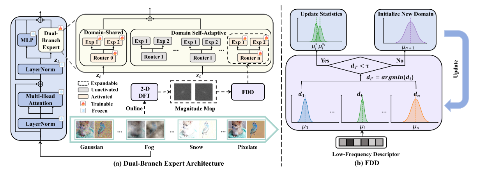

# Domain Self-Adaptive CTTA

This repository is the official cleaned release for the paper *Shared & Domain
Self-Adaptive Experts with Frequency-Aware Discrimination for Continual
Test-Time Adaptation*.

Paper:

- [AAAI-26 paper](https://ojs.aaai.org/index.php/AAAI/article/view/40102)
- [arXiv:2507.00502](https://arxiv.org/abs/2507.00502)

The project implements domain-shared experts, domain self-adaptive experts, and
a Frequency-aware Domain Discriminator (FDD) for Continual Test-Time Adaptation
(CTTA). Datasets and model checkpoints are not included in the GitHub
repository.



## Environment

The code has been tested with:

- Python 3.9
- CUDA 11.x
- NVIDIA A800 80 GB
- Python dependencies listed in [requirements.txt](requirements.txt)

We recommend installing PyTorch and torchvision versions compatible with your
local CUDA installation before installing the remaining dependencies:

```bash
pip install -r requirements.txt
```

The main package versions used in our experiments are:

```text
torch==1.10.0
torchvision==0.11.1
timm==0.4.12
numpy==1.19.5
Pillow==8.4.0
PyYAML==6.0
tqdm==4.56.2
```

## Model Checkpoint

We use a ViT-B/16 model with an input resolution of 224 and 12 Transformer
blocks.

### Checkpoint Initialization

To initialize the expert modules, we start from an ImageNet-pretrained
ViT-B/16, insert the MoE modules, and warm them up by fine-tuning on the
ImageNet training set for several epochs. The resulting checkpoint contains
both the complete source model parameters and the warmed-up expert module.
During online adaptation, the shared experts and the domain self-adaptive
experts created for newly detected domains are initialized from this warmed-up
expert module.

The checkpoint hosted on Hugging Face is:

```text
vit_source_finetuned_imagenet_lr0.0001_freeze_True_epoch8_scalar10.0_.pt
```

[Download the warmed-up MoE checkpoint](https://huggingface.co/jianchao123/Domain-Self-Adaptive-CTTA/resolve/main/vit_source_finetuned_imagenet_lr0.0001_freeze_True_epoch8_scalar10.0_.pt)

## Data Preparation

The directory specified by `--data_root` should contain the ImageNet-C,
ImageNet+, and ImageNet++ datasets in the following structure:

```text
tta_datasets/
├── ImageNet-C/
│   └── <corruption>/<severity>/<synset>/<image>.JPEG
├── imagenet++/
│   ├── imagenetv2-top-images-format-val/
│   └── imagenetv2-threshold0.7-format-val/
├── domain_gen/
│   ├── imagenetv2/imagenetv2-matched-frequency-format-val/
│   ├── imagenet-adversarial/imagenet-a/
│   ├── imagenet-sketch/images/
│   └── imagenet-rendition/imagenet-r/
└── imagenet_class_index.json
```

ImageNet-V2 class directories must be named from `0` to `999`. ImageNet-C,
ImageNet-A, ImageNet-S, and ImageNet-R use ImageNet synset directory names, for
example:

```text
n01440764/
n01443537/
```

The ImageNet-C sample order and class mapping files are provided in the
`metadata/` directory. The evaluation code follows the standard ImageNet
validation order and uses the first 5,000 samples for each corruption by
default.

## ImageNet-C

ImageNet-C is evaluated at severity level 5. The 15 corruption types are
processed in their original order, with 5,000 images per corruption, a batch
size of 50, and one update step per batch. The model is reset only before the
first corruption; its state is carried across all subsequent corruptions.

```bash
CUDA_VISIBLE_DEVICES=0 python imagenetc.py \
  --data_root /path/to/tta_datasets \
  --checkpoint /path/to/vit_source_finetuned_imagenet_lr0.0001_freeze_True_epoch8_scalar10.0_.pt \
  --save_dir /path/to/results/imagenetc
```

## ImageNet+ and ImageNet++

ImageNet+:

```bash
CUDA_VISIBLE_DEVICES=0 python imagenet_plus.py \
  --data_root /path/to/tta_datasets \
  --checkpoint /path/to/vit_source_finetuned_imagenet_lr0.0001_freeze_True_epoch8_scalar10.0_.pt \
  --save_dir /path/to/results/imagenet_plus
```

ImageNet++:

```bash
CUDA_VISIBLE_DEVICES=0 python imagenet_plusplus.py \
  --data_root /path/to/tta_datasets \
  --checkpoint /path/to/vit_source_finetuned_imagenet_lr0.0001_freeze_True_epoch8_scalar10.0_.pt \
  --save_dir /path/to/results/imagenet_plusplus
```

ImageNet+ and ImageNet++ use a batch size of 200 and one update step per batch.
Additional options can be supplied by repeating `--override KEY=VALUE`.

All three entry points use single-process `torch.nn.DataParallel`. For example,
the following command runs ImageNet++ on two GPUs:

```bash
CUDA_VISIBLE_DEVICES=5,6 python imagenet_plusplus.py \
  --data_root /path/to/tta_datasets \
  --checkpoint /path/to/vit_source_finetuned_imagenet_lr0.0001_freeze_True_epoch8_scalar10.0_.pt \
  --save_dir /path/to/results/imagenet_plusplus
```

Dataset and checkpoint paths can also be configured through environment
variables:

```bash
export IMAGENET_DATA_ROOT=/path/to/tta_datasets
export MOE_CHECKPOINT=/path/to/vit_source_finetuned_imagenet_lr0.0001_freeze_True_epoch8_scalar10.0_.pt
```

## Project Structure

- `imagenetc.py`: ImageNet-C entry point.
- `imagenet_plus.py`: ImageNet+ entry point.
- `imagenet_plusplus.py`: ImageNet++ entry point.
- `protocol_common.py`: data ordering, class mapping, and online evaluation for
  ImageNet+ and ImageNet++.
- `moe_runtime.py`, `moe.py`, `inject_moe_1.py`, and `adapter.py`: MoE and
  adapter implementations.
- `metadata/`: ImageNet-C sample-order and class-mapping metadata.
- `robustbench/model_zoo/`: model implementation required by the ViT backbone.
- `cfgs/vit/moe_new.yaml`: base model and optimizer configuration.

## License

The original code in this repository is released under the MIT License. Some
model components are derived from third-party projects and remain subject to
the upstream licenses listed in
[THIRD_PARTY_NOTICES.md](THIRD_PARTY_NOTICES.md).

## Citation

```bibtex
@inproceedings{zhao2026shared,
  title={Shared and Domain Self-Adaptive Experts with Frequency-Aware Discrimination for Continual Test-Time Adaptation},
  author={Zhao, Jianchao and Ding, Chenhao and Dong, SongLin and Li, Jiangyang and Wang, Qiang and He, Yuhang and Gong, Yihong},
  booktitle={Proceedings of the AAAI Conference on Artificial Intelligence},
  volume={40},
  number={34},
  pages={28697--28705},
  year={2026},
  doi={10.1609/aaai.v40i34.40102}
}
```
